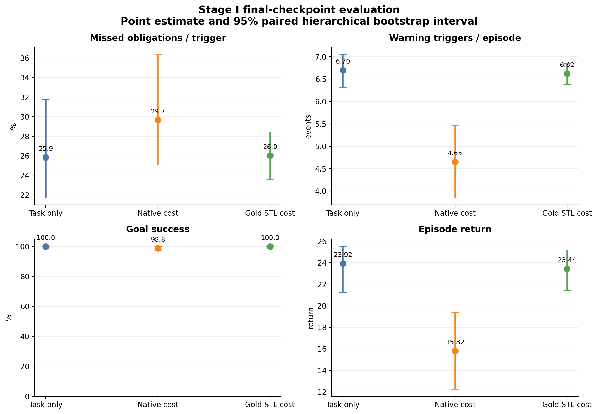
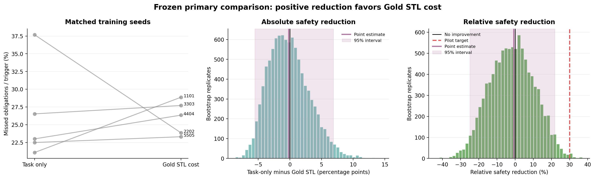
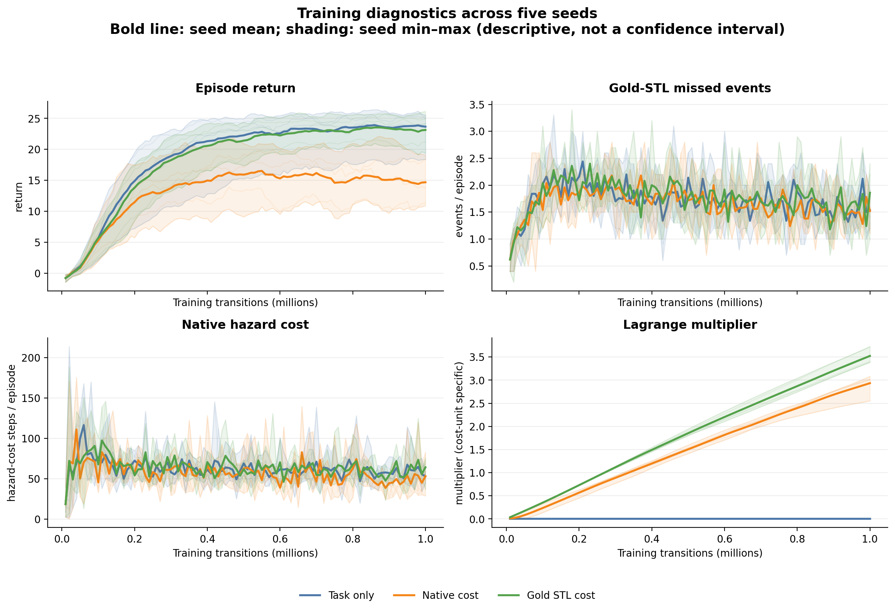
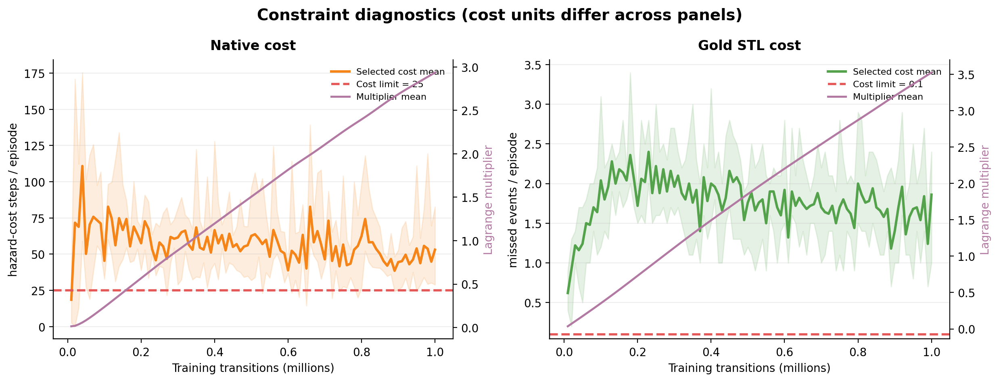

# Stage I Gold-STL Pilot Result Report

- **Report date:** 2026-08-12
- **Protocol:** `stage1_gold_stl_pilot_v1` (D31; pilot only)
- **Result:** full 15-job pilot and frozen analysis completed
- **Primary conclusion:** safety-improvement target not met; goal-success
  non-inferiority met; 1M-transition runs must not be called converged

## 1. Executive conclusion

The complete `3 conditions × 5 training seeds × 1,000,000 transitions` pilot
ran successfully on the matched CUDA backend. Every fixed final checkpoint was
evaluated deterministically on the same 100 seeds, giving 1,500 evaluation
episodes. All online monitor/direct-oracle checks passed, and the maximum RTAMT
robustness difference was zero.

The frozen primary safety result did **not** support the Stage I pilot target:

- task-only missed-recovery rate: **25.85%** of triggered obligations;
- gold-STL-cost rate: **26.03%**;
- absolute reduction, task minus gold: **−0.18 percentage points**
  (95% hierarchical-bootstrap interval **−5.52 to +6.87**);
- relative reduction: **−0.71%**
  (95% interval **−24.92% to +21.88%**);
- predeclared target: at least **+30%** relative reduction.

Positive reduction favors gold-STL cost, so the negative point estimate means
that the gold condition was descriptively, though only slightly, worse on the
primary conditional recovery metric. The interval includes both modest harm
and modest benefit, but excludes the predeclared +30% target.

Goal success was 100% for both task-only and gold-STL conditions. Their paired
difference was 0 percentage points with a bootstrap interval of `[0, 0]`, so
the predeclared 10-percentage-point goal-success non-inferiority criterion was
met.

This is a valid negative pilot result: the verified gold-STL cost reached the
learner, but under the frozen PPOLag budget and hyperparameters it did not
improve the primary safety behavior. It does not show that STL is generally
ineffective, and it does not provide a formal safety guarantee.

## 2. Frozen design and analysis

The analysis was run without changing D31:

| Item | Frozen value |
|---|---|
| Benchmark | `SafetyPointGoal1-v0` |
| Rule | `G(e_t -> F_[0,79](d_t >= 0.55))` |
| Warning threshold | `d_warn=0.45` |
| Conditions | task-only, native cost, gold-STL cost |
| Learner cost limits | task/native/STL = `0.0/25.0/0.1` |
| Training seeds | `1101, 2202, 3303, 4404, 5505` |
| Training budget | 1M transitions per condition and seed |
| Checkpoint | fixed `epoch-100.pt` |
| Evaluation | 100 paired seeds per checkpoint; deterministic policy |
| Primary metric | `(deadline violation + terminal unresolved) / triggers` |
| Primary comparison | gold-STL cost versus task-only |
| Goal criterion | gold minus task, non-inferiority margin `−0.10` |
| Uncertainty | 10,000 paired hierarchical percentile-bootstrap replicates |
| Analysis RNG seed | `20260811` |

Native and STL learner costs have different units. The numerical limits `25.0`
and `0.1`, their multipliers, and their selected-cost curves must not be treated
as directly comparable quantities.

## 3. Integrity and provenance

| Check | Result |
|---|---:|
| Successful jobs | 15 / 15 |
| Failure manifests | 0 |
| Training transitions | 15,000,000 |
| Final-checkpoint evaluation episodes | 1,500 |
| Fixed final checkpoint | all `epoch-100.pt` |
| Deterministic evaluation | 15 / 15 |
| Online/direct-oracle agreement | 1,500 / 1,500 |
| Maximum RTAMT difference | 0 |
| Full package elapsed time | 8.97 hours |
| Logged training time | 8.28 hours |
| Mean training throughput | 503.57 transitions/s |
| Throughput range | 483.63–528.84 transitions/s |
| Peak reserved PyTorch VRAM | 90 MiB |

Every progress file, final checkpoint, evaluation summary and episode CSV was
loaded through its manifest and SHA-256 checked before analysis.

One provenance detail is retained explicitly. `task_only__seed-1101` began
while the launch-preparation implementation was present in a dirty worktree at
commit `84da0dbb...`; the remaining 14 jobs record clean commit
`3975f84c...`, which committed that preparation package. All 15 manifests have
the identical source-tree hash
`b33a4f862061a2728420c17720b3b955fd9ee47734aaef43cd503553767bf6e2`,
the same frozen protocol hash, and the same resolved scientific code/config
surface. The commit difference is therefore a provenance irregularity, not an
observed implementation difference, but it is not hidden.

The analysis/figure environment was:

| Component | Version |
|---|---:|
| Python | 3.8.20 |
| PyTorch | 2.4.1+cu124 |
| OmniSafe | 0.5.0 |
| Safety-Gymnasium | 1.0.0 |
| RTAMT | 0.3.5 |
| NumPy | 1.23.5 |
| Matplotlib | 3.7.5 |
| Pandas | 2.0.3 |
| Seaborn | 0.13.2 |

## 4. Final-checkpoint results

Intervals below are 95% paired hierarchical bootstrap intervals. Counts are
pooled across the five training seeds and 500 episodes per condition.

| Condition | Triggers | Missed | Missed/trigger [95% CI] | Missed/episode | Goal success | Return [95% CI] |
|---|---:|---:|---:|---:|---:|---:|
| Task only | 3,350 | 866 | 25.85% [21.71, 31.77] | 1.732 | 100.0% | 23.92 [21.24, 25.54] |
| Native cost | 2,327 | 690 | 29.65% [25.07, 36.35] | 1.380 | 98.8% | 15.82 [12.26, 19.39] |
| Gold STL cost | 3,311 | 862 | 26.03% [23.61, 28.45] | 1.724 | 100.0% | 23.44 [21.43, 25.18] |

The missed-event components were:

| Condition | Deadline violations | Terminal unresolved | Deadline/trigger | Unresolved/trigger |
|---|---:|---:|---:|---:|
| Task only | 694 | 172 | 20.72% | 5.13% |
| Native cost | 579 | 111 | 24.88% | 4.77% |
| Gold STL cost | 684 | 178 | 20.66% | 5.38% |

### 4.1 Primary comparison

| Quantity | Point estimate | 95% interval | Decision |
|---|---:|---:|---|
| Absolute reduction, task − gold | −0.18 pp | [−5.52, +6.87] pp | no demonstrated reduction |
| Relative reduction | −0.71% | [−24.92%, +21.88%] | 30% target not met |
| Goal success, gold − task | 0.00 pp | [0.00, 0.00] pp | 10-pp non-inferiority supported |

Only one of the five matched training seeds had a lower gold-STL missed-rate
than its task-only counterpart; four had a higher rate. The pooled estimate is
nevertheless close to zero because the conditions produced different numbers
of triggers and the primary metric pools event counts as predeclared.

Two paired evaluation-seed examples show the cross-seed heterogeneity:

| Training/evaluation seed | Task missed/triggers | Gold missed/triggers | Task/gold return | Interpretation |
|---|---:|---:|---:|---|
| `4404/10066` | 0/8 | 5/7 | 24.57 / 18.76 | largest gold-minus-task missed-count example |
| `2202/10031` | 5/6 | 1/7 | 18.72 / 14.85 | one of the largest task-minus-gold examples |

Both policies reached at least one goal in both examples. These are
deterministically selected diagnostic cases, not independent statistical
evidence and not counterfactual action-by-action pairs. Ten examples in both
directions are retained in `paired_episode_examples.csv`.

### 4.2 Secondary native-cost observation

Native-cost training reduced warning exposure from 6.70 to 4.65 triggers per
episode and reduced missed obligations per episode from 1.732 to 1.380.
However, conditional on a trigger, its missed rate was higher (29.65%), and its
mean return was lower (15.82 versus 23.92). This is descriptive because the
frozen primary comparison was gold-STL versus task-only. It also illustrates
why per-episode event counts and missed-per-trigger answer different questions.

## 5. Figures

### 5.1 Evaluation overview



The gold-STL and task-only final policies are almost indistinguishable on the
primary rate, trigger frequency, goal success and return. Native cost changes
the exposure/task trade-off more strongly but does not improve conditional
recovery after a trigger.

### 5.2 Frozen primary comparison



The left panel shows the five matched training-seed pairs. The center and
right panels show the 10,000 bootstrap draws. Positive values favor gold STL;
the red dashed line is the predeclared 30% relative target.

### 5.3 Learning curves



The bold lines are means over five seeds and the shaded regions are seed
minimum-to-maximum ranges. They are descriptive ranges, not confidence
intervals. Task-only and gold-STL returns become broadly stable late in the
pilot, while their missed-event curves remain noisy and similar.

### 5.4 Constraint diagnostics



The two panels deliberately use separate cost units. Over the final 20 epochs:

| Condition | Selected cost mean | Cost limit | Multiplier mean |
|---|---:|---:|---:|
| Native cost | 50.042 hazard-cost steps/episode | 25.0 | 2.690 |
| Gold STL cost | 1.650 missed events/episode | 0.1 | 3.217 |

Both constrained conditions remained above their respective learner budgets.
The gold-STL multiplier continued to rise, with a tail-drift flag in four of
five seeds; the native multiplier had a flag in three of five seeds. This is
direct evidence against treating 1M transitions as a converged solution.

## 6. Interpretation

### Confirmed by this pilot

1. The complete gold-STL monitor-to-PPOLag path is operational under real
   1M-transition training, and its final checkpoints are evaluable by a common
   verified oracle.
2. The gold-STL condition did not achieve the predeclared 30% primary safety
   target and did not show a positive point-estimate reduction.
3. Goal-reaching ability did not collapse; the predeclared goal-success
   non-inferiority criterion passed.
4. The constrained learners did not satisfy their candidate cost limits, and
   multiplier behavior does not support a convergence claim.
5. The verified monitor/oracle agreement means this failure cannot be assigned
   to observed monitor disagreement or to a Stage II language translation
   component, which was absent.

### Plausible mechanisms, not established causes

- the binary cost is sparse and appears only at a missed deadline or unresolved
  terminal obligation, which gives delayed credit;
- the `0.1` missed-events-per-episode budget is much lower than the achieved
  cost under these settings;
- the multiplier/optimizer dynamics may need a larger training horizon or
  prospective tuning;
- the policy may learn goal-reaching faster than conditional recovery because
  warning triggers become common only after task competence improves;
- a semantics-preserving dense diagnostic may be needed to determine whether
  the bottleneck is credit assignment rather than the rule itself.

These are hypotheses for O8. None should be presented as proven by the current
plots.

## 7. Decision consequence

The pilot should be retained as a negative, diagnostically useful Stage I
result. It should **not** be relabeled as the final main study, and simply adding
more evaluation episodes would not repair the learning failure. The learning
curves also do not justify selecting a post-hoc best checkpoint.

The recommended next gate is the bounded O8 diagnostic package in
`stage1_o8_main_study_decision_proposal.md`. No additional large GPU run should
start until O8 fixes whether the final Stage I study will extend the budget,
tune constraint optimization, include a prospective budget sweep, or add a
clearly labeled shaping ablation. Non-compute Stage II benchmark design can
proceed in parallel under `stage2_o7_benchmark_design_proposal.md`.

## 8. Reproduction and artifacts

Run the frozen analysis:

```bash
env PYTHONNOUSERSITE=1 PYTHONPATH=src MUJOCO_GL=egl \
  /home/jerry/anaconda3/envs/stl-stage1/bin/python \
  scripts/analyze_stage1_pilot.py
```

Regenerate all PNG/SVG figures:

```bash
env PYTHONNOUSERSITE=1 PYTHONPATH=src MUJOCO_GL=egl \
  /home/jerry/anaconda3/envs/stl-stage1/bin/python \
  scripts/plot_stage1_pilot.py
```

Primary compact artifacts are under `results/stage1_pilot/analysis/`. Raw job
attempts and checkpoints remain local and ignored; each successful job retains
an immutable manifest with the exact paths and hashes.
