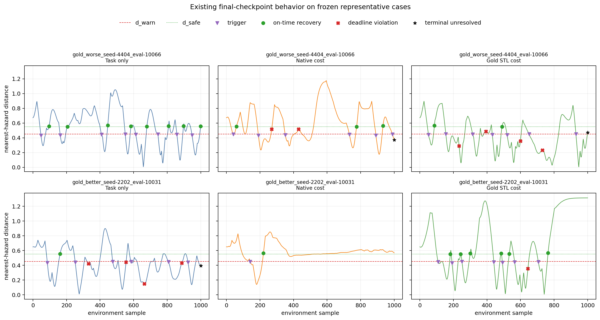
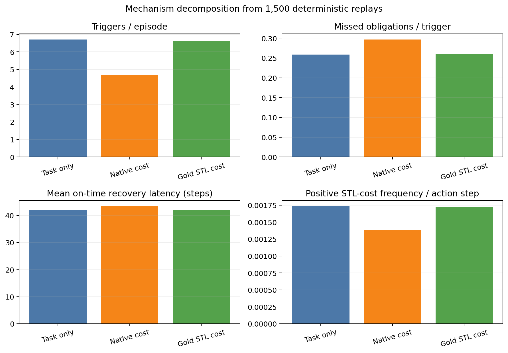

# Stage I Gold-STL Trajectory and Runtime Diagnosis

- **Completed:** 2026-08-12
- **Scope:** existing frozen final checkpoints only
- **Compute:** CPU deterministic evaluation; no training and no checkpoint selection
- **Machine evidence:** `results/post_pilot_diagnosis/`

## 1. Result in one sentence

The Gold-STL evaluator is still exact, but the trained Gold-STL policies are
behaviorally almost indistinguishable from task-only on both hazard-entry
frequency and conditional recovery; the learner saw a binary positive cost on
only `0.1724%` of action steps, always 79 steps after deadline-ending triggers
and about 29 steps after terminal-unresolved triggers on average.

This supports a sparse/delayed training-signal diagnosis. It does not by itself
identify one causal code defect or show that a proposed repair will work.

## 2. Replay and provenance contract

All 15 fixed `epoch-100.pt` checkpoints were replayed using the original five
training seeds and evaluation seeds `10000--10099`. The resulting 1,500
episodes and 1.5 million action steps satisfy all of the following:

- checkpoint SHA-256 equals its successful job manifest;
- episode seed, length, return, native cost, minimum distance and all Gold event
  counts match the previously frozen evaluation CSV;
- online monitor and independent enumerator agree on every event and cost;
- RTAMT maximum completed-window robustness difference is `0.0`;
- policy mode remains deterministic and no best checkpoint is selected.

`summary.json` records all 15 checkpoint paths/hashes and frozen evaluation
hashes. `replayed_episode_diagnostics.csv` and
`representative_per_step_trajectories.csv` retain the public distance, actions,
monitor state, remaining deadline, events, reward, native cost, STL cost and
selected learner cost needed for independent inspection.

## 3. Mechanism-level results

| Quantity | Task only | Native cost | Gold STL cost |
|---|---:|---:|---:|
| Episodes / action steps | 500 / 500,000 | 500 / 500,000 | 500 / 500,000 |
| Trigger count | 3,350 | 2,327 | 3,311 |
| Triggers / episode | 6.700 | 4.654 | 6.622 |
| On-time recoveries | 2,484 | 1,637 | 2,449 |
| On-time recovery / trigger | 74.15% | 70.35% | 73.97% |
| Mean on-time recovery latency | 42.01 steps | 43.33 steps | 41.85 steps |
| Deadline violations | 694 | 579 | 684 |
| Terminal unresolved | 172 | 111 | 178 |
| Missed / trigger | 25.85% | 29.65% | 26.03% |
| Missed events / episode | 1.732 | 1.380 | 1.724 |
| Positive STL cost / action step | 0.1732% | 0.1380% | 0.1724% |
| Goal success | 100.0% | 98.8% | 100.0% |

Relative to task-only, native cost reduced trigger frequency by `30.54%`, but
its conditional missed rate was `3.80` percentage points worse. Its principal
observable change is therefore fewer warning-zone entries, not better recovery
once an entry occurs. This is descriptive final-policy evidence, not a causal
decomposition of the training objective.

Gold-STL reduced trigger frequency by only `1.16%`; its conditional missed rate
was `0.18` percentage points worse and its mean on-time latency was `0.16` step
lower. These differences are negligible relative to the frozen inferential
result. The Gold policy changed neither entry frequency nor conditional
recovery in a material, consistent way.

Every deadline-violation cost arrives exactly `K=79` steps after its trigger.
Terminal-unresolved costs arrive after a variable observed prefix: means were
30.61, 32.22 and 28.96 steps for task/native/Gold. Under the effective pilot
`gamma=0.99`, `lam_c=0.95`, the GAE coefficient from a deadline event back to
its trigger is `(gamma*lam_c)^79 = 0.0078586`; discount alone is
`gamma^79 = 0.45204`.

## 4. Representative traces

The first row uses training seed 4404/evaluation seed 10066, selected from the
already frozen paired table as the largest Gold-minus-task missed-event case.
Task-only had 0 missed events, native had 3 and Gold had 5. The second row uses
seed 2202/evaluation seed 10031, the opposite extreme: task-only had 5 missed,
native 0 and Gold 1. Both rows show that single paired episodes can reverse
direction; they explain behavior but are not representative estimates.

Purple triangles are warning triggers, green circles are on-time recovery,
red crosses are deadline violations and black stars are terminal-unresolved
settlements. Dashed red and dotted green lines are `d_warn=0.45` and
`d_safe=0.55`.

## 5. Effective OmniSafe runtime contract

The installed packages are OmniSafe `0.5.0` and PyTorch `2.4.1+cu124`.
`runtime_contract.json` records the exact installed source paths and hashes;
no file under Conda `site-packages` was changed.

| Item | Declared or intended | Effective installed behavior | Pilot implication |
|---|---|---|---|
| `Metrics/EpCost` window | logger window 100 | hard-coded rolling 50 | lambda and reported `Jc` use 50 completed episodes |
| Cost advantage standardization | enabled | mean-centered, not divided by std | reward and cost advantage scales are asymmetric |
| Cost discount | `cost_gamma=0.99` | on-policy buffer receives shared `gamma=0.99` | code path ignores `cost_gamma`, but current numbers are equal so no numerical pilot difference |
| Actor LR | initial `3e-4`, linear decay | scheduler steps every epoch to final 0 | late lambda pressure coincides with vanishing actor LR; no nonzero floor |
| Lagrange update | init `0.001`, Adam LR `0.035` | reads rolling-50 `Metrics/EpCost` | effective window must be part of future protocol |
| Terminal unresolved | final event cost 1 settles obligation | timeout branch also bootstraps cost value from active final state | semantic double-accounting risk; actual pilot effect is not isolated |

The executable timeout regression supplies a fake final cost value of `7.0`.
OmniSafe passes exactly `last_value_c=7.0` to `finish_path`, whereas the
project's settled episode-cost convention requires `0.0`. The monitor correctly
emits terminal-unresolved cost 1 before that branch, so the mismatch is real.
However, this test proves a semantic risk, not that learned critics produced a
large enough bootstrap value to explain the final policies.

## 6. Supported explanations

The evidence supports the following statements:

1. The current raw learner signal is extremely sparse: about 1.7 positive
   events per 1,000-step episode, or 0.17% of action steps.
2. Deadline-event credit is delayed by 79 steps and strongly attenuated in GAE.
3. The additive learner objective is missed events per episode, whereas the
   primary metric divides missed events by a policy-dependent trigger count.
4. The `0.1 event/episode` budget is far below the observed approximately
   `1.7 event/episode` scale and is not a 10% violation-rate threshold.
5. The actor LR reaches zero while the prior learning-curve report shows the
   Gold multiplier still rising; the pilot is not converged.
6. Installed runtime behavior differs from a literal reading of several config
   fields and contains a confirmed terminal bootstrap semantic risk.

Together these facts make signal sparsity, delay, budget mismatch and optimizer
timing plausible explanations for the negative pilot.

## 7. Rejected or still-unresolved explanations

- **Rejected:** monitor disagreement, wrong cost routing, checkpoint drift,
  nondeterministic evaluation, or reward replacement. All corresponding gates
  passed again.
- **Rejected:** inability to use CUDA. Training already ran on the verified RTX
  4090 environment; this replay intentionally used CPU because it performed no
  learning.
- **Not supported:** the Gold policy learned better recovery but was hidden by
  more triggers. Both trigger frequency and conditional recovery are nearly
  unchanged versus task-only.
- **Not established:** the timeout bootstrap mismatch caused the negative
  result. A future project-owned adapter and critic diagnostics are required to
  isolate its magnitude.
- **Not established:** more transitions alone, a different budget alone, or
  temporal credit redistribution will fix learning.
- **Invalid generalization:** one sparse binary Stage I pilot does not show that
  STL is generally ineffective or provide a formal safety guarantee.

## 8. Consequence for the next gate

The no-training diagnosis gate passes: the project can now state exactly when
cost appears, how sparse and delayed it is, which behavior changed, and which
runtime risks are confirmed. Any future O8 diagnostic should first implement a
project-owned terminal-bootstrap contract and prospective diagnostics for raw
cost, effective rolling `Jc`, cost advantage/value calibration, actor gradient,
lambda and LR. It must preserve raw Gold events and use the unchanged Gold
evaluator.

This report does not approve that adapter change, a budget sweep, shaping, or a
new GPU run. Those remain O8 decisions.
